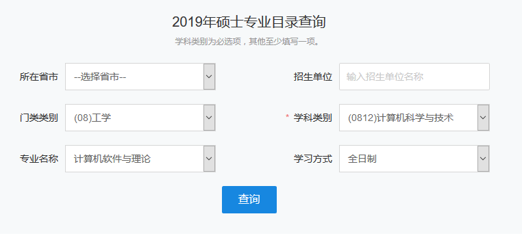
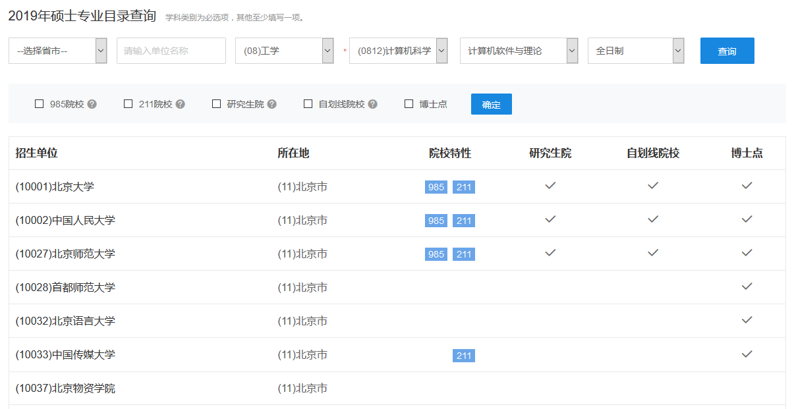

---
title: 关于保研的一点闲言碎语
categories: 
- 眼前的路
tags:
---

# 关于保研的一点闲言碎语

**献给还在迷茫的你**

作者：芣苢

这篇文章是我在保研过程中所做功课的笔记与总结（有些纯粹是我个人的总结，但更多地是我在某些网络资源、某本书上的摘录与二次加工），现在把它们总结、整理并重写编写一下分享出来，希望能够帮助到有需要的学弟学妹们。

**不过需要注意的是，以下的分享均是我的个人感受与体会，很多信息都没有经过严格的考据，因此难免会有疏漏和片面，各位看官仅作参考就好。**

联系我：

QQ：634428559 / 2043739214

email：[liuxinchen1997@163.com](mailto:liuxinchen1997@163.com) / [liuxinchen1997@gmail.com](mailto:liuxinchen1997@gmail.com)

**欢迎交流。因为某些原因，可能不能及时回复。有时可能会忘记回复，如果这样请再联系我一次。带来不便，敬请谅解。**

## 1 一些科普

### 1.1 保研过程

保研大致可以分为1+3个阶段。

注意，我这里的&quot;3&quot;是指参加各个学校研究所的考核活动的3个阶段。而这里的&quot;1&quot;指的是准备阶段。

事实上，准备阶段是最重要的，所谓&quot;养兵千日，用兵一时&quot;，远了说准备阶段是你三年的勤奋刻苦的学习，近了说准备阶段是你为即将到来的保研考核活动所做的一切准备——了解各个院校的信息、准备保研文案（包括 **简历** 、 **个人陈述** 、 **推荐信** 等）、联系导师等。

所谓考核活动的3个阶段依我的理解大致就是：

**1. 夏令营**

这个活动是最早的，时间跨度也较长，最早的夏令营甚至在5、6月份就举办了，最迟的甚至有在8月份举办的（比如我参加的自动化所的第二期夏令营就是在8.20-8.24举办的），当然这些都是极端的情况，据我所知的计算机类的夏令营大多都是集中在7月份举办的，尤其是从7月份中上旬到7月份中下旬。

需要注意的是，夏令营报名截止日期这个时间节点一般都是会比举办日期这个时间节点早一个月多的，所以学弟学妹们一定要做足功课，查看好信息，防止错过报名时间。

夏令营的通知一般在各个学校学院的官网/研究生招生网会贴出来。当然，保研论坛每年也会有一个汇总帖，非常贴心地为我们整理好了各个学校的夏令营通知，这是[传送门](http://www.eeban.com/forum.php?mod=viewthread&amp;tid=29212&amp;extra=page%3D1%26filter%3Dtypeid%26typeid%3D7)。

另外计算机类的夏令营信息汇总也是有的：[1. 传送门A](https://github.com/dhx000/CSBaoYan2018)。 [2. 传送门B](https://blog.csdn.net/lyj2014211626/article/details/73744239)。

有关夏令营更详细的介绍见1.2.

**2. 预推免**

大概在八九月份吧（一般是九月份，特别是九月中旬下旬），各个学校就要举办预推免了。顾名思义，预推免就是推免的前奏。 **不过，虽然是前奏，但是一定要在这个阶段保证自己手上是有offer的，否则后面就有些危险了，因为最后的推免阶段实际上机会已经不多了。**

预推免不同的院所政策也会是不同的，有的院所是没有夏令营只有预推免的，有的院所是有夏令营但是没有预推免的，有的院所是既有夏令营也有预推免的（这个时候预推免可能就是用于补招人的，因为夏令营人没招满），还有的院所是规定夏令营没有通过就不允许再参加预推免了（比如北航计算机学院），所以这一点也要格外注意！

关于预推免的信息，保研论坛也非常贴心地帮助我们整理好了，这是[传送门](http://www.eeban.com/forum.php?mod=viewthread&amp;tid=60380&amp;extra=page%3D1%26filter%3Dtypeid%26typeid%3D18)。

关于预推免更详细的介绍见1.3.

**3. 正式推免**

虽然叫&quot;正式推免&quot;，但实际上这个时候大多数人的保研已经结束了。预推免和正式推免阶段的分界线大概可以从学信网的推免系统开放的那一天算起，正式推免的结束时间应该就是推免系统关闭的时间。2018年是2018.9.28至2018.10.24。

大致的流程就是：

1. 学信网的推免系统开放之后，我们可以登录进入系统，然后填报志愿（好像是最多可以填3个目标院校）。

2. 填报志愿结束之后，等待目标院校发送考核通知。

3. 点击接受目标院校的考核。不过这个时候，如果你有offer的话，你实际上是已经通过了之前夏令营或者预推免的考核的，也就是说这时你就不需要真的再去那个目标院校参与考核，而只是走个过场形式。

4. 等待目标院校发送待录取通知。如果你是之前已经通过了夏令营和预推免的考核的话，那么目标院校就会直接给你发送待录取通知了。当然，如果你没有参与过目标院校的考核，那么你就得真的前往目标院校进行考核，考核通过之后，目标院校就会给你发放待录取通知。

5. 接受目标院校的待录取通知。

完成以上的步骤，那么恭喜你，你的保研生涯已经结束了。

如果在前两个阶段（夏令营+预推免）没有拿到offer后者没有拿到心仪的offer，那么也不必灰心，因为正式推免阶段也会是有一些机会的，另外正式推免阶段还会有一些捡漏的机会（一些大佬会把有些学校鸽了，这样那些学校就会在正式推免阶段再招一些人）。不过，前提是你得有充足的信息获取渠道。念念不忘，必有回响。如果你真的很想去一个地方的话，总是会有机会的！

### 1.2 夏令营

夏令营一般是优中选优，选拔门槛高，一般都只会挑最优秀的同学入营。并且夏令营一般活动较为丰富（特别是中科大和中科院的夏令营），内容不局限于考核，还包括了参观、讲座、素拓等活动，这是一个让大家互相了解（他们在考核你的同时，你也在选择他们），勾搭导师的好机会。另外夏令营的交通费、食宿也基本都是会包的（这个不同学校也不一样）。

夏令营的通过率一般来说也是最高的。据我的总结就是——&quot;入营难，通过易，抢到大牛导师难&quot;。

据我的体验来看，夏令营主要分为了3种考核方式：

① **院所集中考核** ：这种考核方式是最常见的，也就是你报名的夏令营举办单位举行集中的考核，集中地选拔出一批人。但是，当你最后拿到offer了之后你还不能放松，你还得赶紧确定你的导师，这个时候各个导师可能还会存在二次考核。这个不同的院所也是不一样的，比如北航是即使你找不到导师也没有关系，学院最后也会给你分配一个导师；但是自动化所就是你必须得与一个导师达成双选，否则即便你已经通过了所里的考核也是没有用的。不过一般而言集中考核过了，与一个导师确定就比较容易了，只是想找到自己很满意的导师那是很难的。

② **各个实验室/导师单独考核** ：这种考核方式好像很少，我参加的夏令营中好像只有软件所是这么做的。院所里的各个实验室、研究中心单独组织考核。所以这就存在一个选择的问题了，热门的实验室自然竞争激烈，很难进去；而冷门的实验室则相对而言好进得多。

③ **集中考核与单独考核并行** ：这种考核方式说实话我还没太碰到过，只能说中科大的考核方式有点类似于这样。但是中科大的夏令营基本上是不筛人的，院所（仅指计算机学院）的考核很容易，通过率极高。不过，在你参加夏令营的期间，各个实验室也会单独举行考核（一般安排在晚上，因为没有其他活动）。这里有的实验室很热门考核筛率很高，不过好在有些实验室的考核时间并不冲突，可以都参加一下的。

考核的内容按我参加的夏令营来看，大概就是：笔试、机试和面试3种了。具体细节可以参见我的上一篇分享 **《保研老炮的七城记》** 嘻嘻嘻！

### 1.3 预推免

预推免与夏令营相比就单调很多了，就真的只是考核了，一般除了考核就没有其他任何活动了。因此活动时间也很短，一般就只有一两天。另外，相关院所也不会提供任何费用资助，食宿啥的全得自己包。

其他的，预推免的考核与夏令营的考核也就差不多了，不过预推免可能更严格一些，因为预推免的通过率一般要比夏令营低，因为进入预推免活动的人一般会比较多。

其实，绝大多数人都是在这个阶段拿到offer的，毕竟夏令营入营门槛一般偏高。另外，也一定要在这个阶段保证自己是有offer的，这样才比较稳妥与安全。

## 2 目标确定

保研准备阶段，我们应该早早地就将自己的目标确定，这里的目标应该包括三个维度：①定专业②定学校③定导师

### 2.1 定专业

你需要确定你将来的学科类别、专业名称、理想的研究方向。这些你都是可以确定多个的，事实上我发现硕士的话好像各种划分得并不是很严格。

想要查询具体有哪些学科、专业的话，可以去研究生招生网查看，这是[传送门](https://yz.chsi.com.cn/zsml/zyfx_search.jsp)。

以下是查询截图：

查询结果截图：

### 2.2 定学校

筛选学校可以从学科排名、招生人数、自己的未来职业规划（比如自己计划以后想在某个城市发展）等。当然，最最重要的筛选指标还得包括你的师兄师姐，因为你的师兄师姐能去什么样的学校，也就 **大概率** 地决定了你能去什么样的学校，但这也并不是绝对的。

关于学校的学科排名，大家可以关注[青塔网](https://www.cingta.com/)。

### 2.3 定导师

确定导师应该从 **科研水平学术能力** 和 **个人特质** 这两个衡量标准来进行确定。注意，确定导师这一环节是最重要的，大家一定要多花时间，千万不要随便敷衍了事。

**[1] 科研水平、学术能力**

科研水平和学术能力的评判标准有很多。首先最直观的，我们可以从导师的头衔来进行判断。

相信有过一些了解的同学都知道，导师的头衔种类多且复杂，让人很难抉择。我这里将各种头衔的含金量按照从高到低进行简单地排序。 **并不能完全保证内容的严谨性，仅供参考：**

1. 院士、万人计划中的杰出人才

2. 国家重点研发计划首席（863计划、973计划）

3. 千人计划、万人计划、杰青、长江学者

4. 优青、青年千人计划、万人计划中的青年拔尖

除了头衔之外，我在我的上一篇分享《保研老炮的七城记》中也提到了另一种方法：去导师的个人主页去查看导师的研究方向以及近几年发表的论文，判断是否与自己的兴趣点契合。另外，还可以去谷歌学术或者[Aminer](https://www.aminer.cn/)查看导师的h index来进行快速判断。[CS Ranking](http://csrankings.org/#/fromyear/2008/toyear/2018/index?all)也有一点资料可以查看（主要针对计算机类的同学）。和我上面说的一样，这些都只是参考，不要过度迷信就好~

**[2] 个人特质**

个人特质可以从各种贴吧论坛、[导师评价网](https://www.mysupervisor.org/)以及导师的研究生等各种渠道获取，一般而言这些信息是较难获取的，无法获取其实也没什么，其实只要导师不要太…就好，其余都是可以接受的。

1. 科研指导

是否亲力亲为、答疑解惑，是更push一些还是更放养一些。一般而言，年轻的导师可能会在学术指导上给予更多的帮助，但这也不是绝对的。

2. 性格

这一点就比较抽象了，可以从做事是否公正啦，脾气如何啦等方面了解。

3. 是否关注学生的未来成长

这一点是最重要的，比如是否尊重你的选择（你感兴趣的课题/研究方向）、是否允许实习（如果你想着念完硕士赶紧出来工作的话）等。

4. 是否有人情味

这一点请细细体会，比如导师是不是个加班工作狂，不管你们是否休息，拼命让你们加班等。不过如果你也是一个工作狂，极度热爱科研的话，那这其实也并不是不好的。

综合来看，建议你确定多所目标院校，可以分为 **保底、符合预期、冲刺** 三类。每个学校可以确定3-4（数字仅供参考）位感兴趣的导师，方便后面联系，如果某位导师因为某些原因招生名额满了或是啥的把你拒了，你还有其他导师可以联系。

另外， **同一个学校的不同导师最好不要同时联系** ，如果两个导师的办公室离得很近甚至是同一个办公室同一个组里的话就更不能同时联系了。 **不同学校的导师是可以同时联系的** 。

## 3 简历

### 3.1 负面教材

忌讳的四种简历类型：

**（1）错误模板**

使用的简历模板一定要简洁干练，不要为了追求标新立异而弄得花里胡哨，效果会适得其反。

**（2）毫无重点**

重点很重要，比如你拿了一个含金量超级高的大奖，那么你就一定要尽可能地把它体现出来。而你如果不注意这一点，而把它和一堆可有可无的小奖罗列在一起，那么导师是可能会忽略它的，毕竟导师的时间有限，不可能还会仔仔细细地反复看你的简历的。

**（3）内容空洞**

简历内容要真的有货，要具体，最好还要能用数据等方面来支撑。另外，证明材料也是可以的，不过证明材料一定不要和简历放在一起，给导师发邮件的时候，简历需要作为一个单独的附件来发送。

**（4）疯狂自high**

这个不解释哈哈哈。

### 3.2 具体内容

简历需要填写的内容包括： **基本项、教育背景、科研能力、奖项荣誉、专业技能、实践经历** 等。注意，奖项荣誉一定要有重点，比如那些含金量很高的奖项一定要着重凸显出来（加粗），有些太水太水的奖也就可以不用写了。

当然，如果发现自己经历并不是很多，简历内容不够充实的话，可以再写一点 **研究生规划、自我评价、个人爱好** 作为附件项来充实自己的简历。但是如果你上面几项已经很多了的话，这三项就不要写了，简历尽量要内容简洁干练，我认为最好一页纸搞定，最多最多两页纸。

**基本项**

其中， **基本项** 需要包括 **籍贯、电话、邮箱、紧急联系人、政治面貌、姓名、性别、年龄、读博意向** 等。如果可以的话，最好再加一张 **眉清目秀的个人照片** 。个人照片一定要显得人干净、整洁、大方、自然，这样才会成为你的简历的加分项。

再者，我再来说说一些细节问题。 **籍贯** 是很重要的，有些导师是很有家乡情结的，如果你感兴趣的导师发现你和他是老乡，那么在一定程度上就会与你距离拉近不少，并且也会在无形中为你加分很多。在参加西交夏令营的时候，室友联系的导师和他竟然就是老乡，所谓&quot;老乡见老乡，两眼泪汪汪&quot;，据他说他和导师聊天相当愉快，给人一种&quot;钦定了&quot;的感觉。

再来说说 **读博意向** ，如果现在就有立志读博的打算的话，那么一定要尽可能地体现出来，因为导师都是倾向于招收直博/硕博生的，如果你告诉他你想读博，那么会为你的成功率提升不少。另外，直博生一般都是组里的大牛导师带的，这一点也非常好。

另外，在简历的制作过程中， **电子邮箱** 最好加上超链接，这样导师想要给你发送邮件的话直接点击就可以发送，非常方便。

**奖项荣誉/科研能力/工程项目经历**

再来说一说 **奖项荣誉/科研能力/工程项目经历** 。在简历中，这个肯定是主角。我们在写的时候一定要尽量遵循以下三大原则：

①真实性原则：这是根本，千万不要造假说谎！首先，只要你造假，专业领域的导师在面试你的时候只要稍稍一问，就会清楚这其中的水分，然后对你的印象大打折扣。其次，造假也会给你的本科母校抹黑，给今后学弟学妹们的保研之路带来负面影响。

②匹配性原则：如果时间充裕，并且你真的对某个导师非常感兴趣的话，那么你就真的不要怕麻烦，为这个老师制作一份专属的简历，也就是说在写科研/工程项目经历的时候尽量能和导师的研究方向/项目等相匹配，这样导师是会对你很感兴趣的。

③书面性原则：尽量用书面语言来写，罗列奖项/项目之类的时候一定要把名字列全了。比如不要只简单地写&quot;数学建模国赛&quot;，而应写&quot;20XX年&#39;高教社杯&#39;全国大学生数学建模竞赛&quot;。

所以在简历中一定要分清主次，对重要的经历可以稍微展开来写一写，简单说一说自己在项目中的身份（主持人/组长/核心成员等），自己做了什么，收获了什么，但也不要写太多了。 **划水的项目、没什么收获的项目就不要写了，免得给自己挖坑。**

对于项目的罗列，可以简单参考&quot; **项目名称、工作内容、工作成果、起止时间、你的身份、摆数据简单地把项目说明白&quot;** 的格式来写。

另外， **参与了但是没有得奖的项目也是可以写的，不过前提是自己真的得有很大的收获才行。**

项目经历/奖项荣誉需要按照一定的顺序来罗列，可以把重要的/含金量高的项目放在前面，或者可以按照级别倒序（国际级、国家级、省级、市级等）来排列，或者可以按照时间倒序。

**教育背景**

在写 **教育背景** 的时候，需要注意导师实际上关注的就是：1. 你的成绩是否足够优秀（ **年级排名及主要课程成绩** ）。2. 判断你与老师的研究方向是否匹配（ **重要专业课及成绩** ）。比如说你感兴趣的导师是做操作系统的，那么你的本科成绩单中操作系统这门课的成绩是不是就显得很重要了呀。

**专业技能**

关于 **专业技能** ，可以写一写英语水平、所获得的证书等。

**实践经历**

关于 **综合能力/实践经历** ，可以从爱好、学生工作、社会实践等角度写一写，但是语言一定来精炼，并且最好不要超过两条。

对于附加项，如果以上内容已经很充实了，那就请忽略以下的内容吧。

**研究生计划**

主要从现状分析（自身优势）、存在问题、总体目标等角度来写。总体格式可以是：

第一年做什么，解决什么问题，达成什么总体目标。

第二年……

第三年……

**自我评价**

这一部分导师一般是基本不会看的，写的时候主要不要太主观，每夸一句自己最好能附加一个事例来证明一下。

**个人爱好**

注意最好能与导师有共同爱好，找共同点，这样能引起导师的兴趣。

最后再来几个简历制作的tips：

1. 简历制作 **最好** 能做到因人而异，也就是针对不同研究方向的导师，使用不同的简历。不过前提是你得有充足的时间来做这个啦。所以我们最好能有一个自己的 **简历库** 。

2. 在简历上的内容自己一定要弄懂，一定要能解释清楚，千万不要给自己挖坑。

3. 慎用&quot;精通&quot;。相信大家都听说过&quot;精通C++&quot;这个梗吧（笑哭）。

4. 简历最后提交的格式一定要是pdf！一定要是pdf！一定要是pdf！命名可以是&quot;申请攻读硕士/博士研究生-学校-姓名&quot;。

### 3.3 制作步骤

1. 成立自己的简历库（匹配性原则），编写初稿，写一写简单的文案。书写思维导图，把需要写的点厘清。

2. 分析与匹配方向。优先匹配相关性经历，比如学硕可能更重视科研经历，而专硕可能更重视实习工程经历。挖掘与导师研究方向相关的科研经历。挖掘与导师相关的兴趣爱好。

3. 开始制作，可以使用五白丁之类的网站来制作简历。

## 4 个人陈述

### 4.1 是什么

我认为，个人陈述就是为了表达简历之外的东西，或者是对简历内容的补充。也就是简历为了简洁而没有写但值得写的东西，现在给你这个机会来写了，这个机会就是个人陈述。

### 4.2 主要内容

个人陈述主要内容包括 **研究能力、想要的研究方向和未来规划** 。如果再加上 **开头的简短自我介绍** 和 **结束感谢语** ，那么这就是一篇完整的个人陈述了。

**[1] 简短自我介绍**

常规的自我介绍，自报家门。最好还能简短地说一说为什么想来这个学校、这个专业。

**[2] 研究能力**

着重性开展对几个项目的介绍。注意，在简历中是只需简要说明就好，但是在个人陈述中需要详细说明。

**[3] 研究方向**

确定研究方向，说一说为什么对这个研究方向感兴趣。

**[4] 未来规划**

从 **现状分析（对哪些方面熟悉、优势）、存在问题、总体目标和科研重心** 等角度来写。

**[5] 结束感谢语**

夸一夸目标院校/老师，并表达诚挚的感谢与祝福。

### 4.3 其他tips

1. 个人陈述并不是越长越好，不同院校对个人陈述的字数要求也是不同的，比如1000字以内、1500字左右等。

2. 提交的时候，个人陈述也需要使用pdf格式提交，防止因为word版本不同而导致你的文档在老师那边打开格式会花。

3. 写个人缺点是可选项。但需要注意，致命缺点不要写；不要耍小聪明故意将优点写成缺点；写一些自己正在积极改正的缺点。

4. 个人陈述最好能有一个响亮新颖的名字。比如：使用机器学习撬开未来的大门是我的学术梦想

## 5 导师邮件

在保研过程中，使用邮件联系导师的重要性不言而喻。如果你足够幸运可以通过邮件联系上某位导师，那么这将为你的保研之路带来极大的捷径。

### 5.1 如何写

**Part 1 标题与显示名**

言简意赅。

标题：20XX年保研自荐信-你的姓名-直博/直硕

显示名：将你的邮箱的显示名设置为你的名字

**Part 2 正文**

称呼：XX老师，一定要加上老师的姓氏

分段：每一段只讲一件事，并且每段最好按照总—分的格式来写，注意文字的精简。正文字数最好能控制在350字左右。

**具体内容**

（1）表明来意

我是谁，来自哪里，并一步到位地说清楚希望通过推免的方式攻读硕士/博士研究生

（2）情况概述（150字左右）

名词、专业、突出地方（获奖）、成绩优异学科

（3）师从原因（这个很重要）

为什么选择这个导师、这个专业。夸一夸你联系的导师。需要因人而异，这样才能说明你的邮件并不是群发的，才能体现出你的诚意。

（4）表示感谢，提示查阅附件，祝福语

**Part 3 附件**

[1]必备附件：个人简历、个人成绩单等

[2]可选附件：个人陈述、未来研究计划（从个人陈述中摘离出来单独成一个文件）、简历证明材料等

### 5.2 书写Tips

1. 邮件内容排版只使用 **分段、缩进和加粗** 就好，尽量不要再使用其他格式了。

2. 附件尽量都使用pdf文件，附件中个人简历是最重要的。

3. 在邮箱中设置&quot;发信前检查&quot;，比如163邮箱就可以设置30s后再发送。

4. 千万不要设置&quot;已读回执&quot;，这样会让导师觉得你很没有礼貌。

### 5.3 如何回复导师

发送邮件之后，无非就是两种情况——有回复和无回复，而其中有回复这里又简单分成了9种情况，所以以下我将简要介绍一下这9+1种情况应该如何处理。

**[0] 无回复**

三天原则，等待三天如果导师还是没有回复的话，可以再给导师发送一封，并继续等待三天。有些导师平时很忙，各种工作、出差之类的，所以不能立即回复是很正常的事情。我记得我联系的一个导师是过了将近10天才回复我的（这种情况已经比较极端了）。

如果第二次发送等了三天还是没有回复的话那就多半是&quot;默拒&quot;了，可以考虑去联系其他的老师了。

以下是有回复的九种情况：

**[1] 明确拒绝类**

导师回复&quot;不好意思，名额已经没了/已招满&quot;之类的都是明确拒绝了，这时候应该礼貌地回复一下&quot;谢谢&quot;。如果可以的话，也可以询问一下导师是否可以帮忙推荐一下给其他导师。

**[2] 明确接收类**

这个你就非常幸运了。记得和导师保持沟通，交流深度信息，比如给你的名额是学硕/专硕，具体是什么方向等。

**[3] 主动提出深入沟通类**

这个也表现出导师对你的兴趣很大，只是还想进一步了解你，如果可以的话，一定要接受老师的邀约，或者主动邀约与老师电话联系或者见面沟通。

**[4] 提出问题类**

导师可能会提一个问题考查你，这时候你就需要做一些功课，最好能试着用自己的见解回答一下问题，对错不重要。

**[5] 等待夏令营录取类**

静静等待，如果能进入夏令营的话，最好积极争取提前与导师约谈见面的机会。如果未被夏令营录取，也可以及时与老师联系。也许老师会在一定程度上帮助你呢也说不定呢。

比如计算所的夏令营，如果你没有入营的话，你可以积极联系某位导师，如果那位导师对你蛮感兴趣想要考查你的话，你也是可以前往计算所参与考核的，只是可能一切都需要自费了。

**[6] 等待实验室/课题组预录取面试类**

这个时候你可以询问老师需要准备哪些方面的知识，好让自己早做准备。

**[7] 等待九月推免类**

和以上夏令营一样，争取与导师提前见面的机会。

**[8] 联系招生负责人类**

主动联系招生负责人，将自己的简历+感兴趣的导师发送给相关招生负责人。

**[9] 不走心欢迎类**

这种情况应该是最多的，俗称&quot;官回&quot;。这种时候导师可能仅仅只是出于礼貌而给你回复，实际上对你兴趣并不强。

如果你真的对这个导师很感兴趣的话，那就得花时间让人家对你感兴趣了。包括积极了解导师的研究领域，与导师探讨相关领域的学术问题，读导师的论文或相关领域大牛的文章并制作学术总结报告PPT发送给导师等。这一过程是很花时间、很磨人的。

## 6 面试

### 6.1 自我介绍

一般在面试的开头，老师都会要求你做自我介绍，因此准备一下自我介绍是非常重要和关键的。自我介绍一般可以分为10s，1min，3-5min三类。所以如果有时间的话，各种时长的自我介绍都应该准备一下，中英文的自我介绍也都应该准备一下。

**[1] 10s超短自我介绍**

这种自我介绍主要就是自发的，用于在开始面试的时候，你在分发简历或者老师们在看你的简历没有人说话的时候你做的自我介绍，主要是为了缓解安静的气氛，让老师们能对你有一个更加深刻的印象。

这种自我介绍的内容可以是 **对自己姓名的艺术化** ，比如：各种老师们好，我的名字叫耿佳楠，即使在未来的科研道路上更加难，我也会勇往直前，坚持下去的！这里&quot;耿佳楠&quot;和&quot;更加难&quot;近音。

**[2] 1min自我介绍**

参考内容：基本信息 + 一段最出彩的经历

**[3] 3-5min或者更长自我介绍**

参考内容：基本信息 + 个人特长（科研优势、感悟） + 研究生规划、择校原因等

### 6.2 经历类常见问答

**1. 教育背景类**

[1] 为什么选择这个专业/学校？

[2] 是否参加了其它学校的面试？

[…]

**2. 科研类**

回答按照背景、任务问题、解决方案、成果的框架来进行。

**3. 实践活动/生活经历**

回答按照背景（background）、行为（behavior）和收获（benefit）的3B法则来进行。

**4. 兴趣爱好**

是什么、时长、收获了什么

### 6.3 电话面试/视频面试

电话面试和视频面试我都接触过，一点小建议就是一定要找一个安静的地方，注意要戴上耳机，准备好纸笔。这样就可以解放双手，在与导师交流的过程中，在纸上有所记录啥的。

### 6.4 一对一面试

这种面试一般出现在你与导师单独地私下里见面，属于一次非正式的面谈。注意，一定要携带简历和成绩单这些文件，然后导师一般都会直接就着简历和成绩单问你一些问题来考查你。

首先，礼貌是最重要的，见面需要问好，离开需要告别，这些我就不强调了。

其次，要真诚。如果基础知识类的问题自己不会，就要诚实地回答不太了解/忘记了等，没什么大不了的。

对于考查解决问题能力的提问，一定要询问清楚题意，一定不要不好意思，并且一定要有所想法就说，不一定非要能将这个问题非常合理地解决。事实上，你在说出自己当前的想法的同时，导师也会慢慢引导你，引导你走向最终的答案。

有个小技巧，就是要 **学会引导** ，你可以在自我介绍或者提问间隙适时地暗示与引导，引导导师提问你擅长的领域和问题。

在交流的过程中，你应该是一个自信、有梦想、有想法的学生，这样就会让导师产生对你倾诉的欲望，进而你们就可以进行聊人生梦想、讲一讲研究方向等更深一步的探讨。

### 6.5 群面

一般保研阶段的面试考核都会是群面，这也是非常正式的面试了。一般面试的老师人数是6-8人（数字仅供参考），因为要确保最好每一个研究领域都有一位老师在场，有的甚至还会有一名政治老师。

即使是群面，你最好也要携带你的简历，然后每一位老师发一份。

与一对一的非正式面试不同，群面是相当正式的面试了，所以绝不能像上面一对一面试一样带着闲聊的态度来回答问题，要做到问什么就答什么，不要多说废话或者你认为有必要但实际没有必要的冗长的铺垫。我就曾被怼过2-3次，说我啰嗦、没有直切重点。

另外，说话的时候不要紧张，适当放慢语速，说得清清楚楚，这是自信的表现。如果说错了话或者有什么问题不会的话，直接道歉/不好意思，我没有学过/没有了解过就好，不必太追求完美，不会是很正常的，没啥可耻的啦！

### 6.6 压力面试

在一对一面试或者群面的过程中，可能会出现压力面试。所谓&quot;压力面试&quot;，就是面试者会故意问你一些很刁钻的问题来为难你，或者各种怼你，让你觉得自己实在是太菜了。

压力面试我就亲身经历过，当时在面试的时候被各种怼，各种嫌弃，不过还好我脸皮够厚、心态够好挺过来了。

对于压力面试，最最重要的就是要稳住心态，即使啥也不会也要面带微笑，然后慢条斯理地说声&quot;不好意思，这个我还没有了解过，我回去之后会好好研究研究的&quot;。其实被怼或者很多问题没有答出来也不必难过，因为其他人一定也都和你差不多的。

### 6.7 克服紧张的方法

1. 结果轻化。把面试这一事情放到整个人生的进程中来看，这时它是多么的不起眼，说实话一次面试的成败真的不能决定什么。

2. 我们需要尊重老师，这是没错的。但是我们也需要正确看待面试老师，我们没必要过分害怕或是什么，在某种层面上，我们是平等的。因为他们在选择你的同时，你也在选择他们，这本就是一个双向选择的过程。

3. 不要盲目追求完美，面试有问题答不出来是很正常的事情，不要因为一两个问题回答得不好就心态崩了。

## 7 最后忠告

1. 真诚。这点最重要，千万不要耍小聪明在自己的简历上说大话、说讲话。

2. 放平心态，宠辱不惊。保研过程肯定不是一帆风顺的，拿到offer或者没拿到offer，对你的心态都是极大的考验。没有拿到offer你会难过，但是拿到了offer你又会面临选择与纠结。所以，放平心态，一切都没什么大不了的。

3. 珍视同学情谊，不要陷入恶性竞争。和你一起保研的小伙伴是你的战友而不是敌人，你们的眼界不应该局限得这么小。但愿这条忠告是多余的。

## 8 后记

写完这篇分享，我才深切地感受到自己这大半年的保研之路走过来，竟然做了这么多功课、花了这么多时间和精力。庆幸自己能够坚持把这两篇分享写完，也算是对过去的自己的一个总结和交代，真好。

写作这两篇分享最原始的初衷，是因为自己的保研之路上遇到了很多善良而可爱的人儿，他们在我迷茫惶惑、灰心丧气的时候给予了我极大的鼓励与帮助。我在感谢他们的同时更感到了自己肩上的责任，因为我深切地感受到了这种对于学弟学妹们的帮助，于我只是举手之劳，但是于他人可能就是意义重大的哇！也许，我这一点点的信息分享能够为某个未来的保研人减少一丝丝的疑惑和焦虑，让他能少走一点弯路，那么我的目的也就达到了。

再一次地，诚挚地感谢所有善良而可爱的人儿。再一次地，真心地祝福每一位即将踏上保研征途的人儿，你们都能够收获满意的offer。念念不忘，必有回响。不忘初心，方得始终。加油！

码字不易，转载请注明出处。