# Git填坑系列之（1）版本回退

### 1.1 版本回退

> 之前在实习时因为版本回退问题踩过坑，现在开始填坑，顺便系统了解了解Git的回退机制。

1. 首先我们在GitHub上创建一个项目Test，用于测试使用：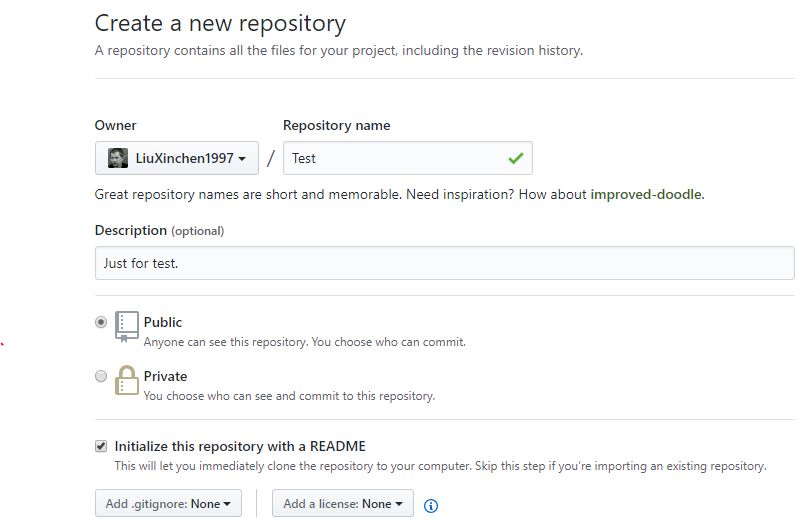

2. 将项目clone到本地：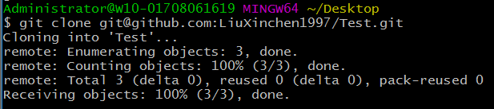

   这样我们就相当于是在本地直接获得了一个git管理的项目，并且已经和远端建立好了联系。如果我们直接使用`git init`也是可以在本地创建一个git管理的项目的，只是还没有和远端建立联系。

3. 我们尝试做一些commit，我是创建了文件**info.txt**。我一共做了3次commit（**注意：我的commit均没有push**），commit的内容可以使用`git log`来查看：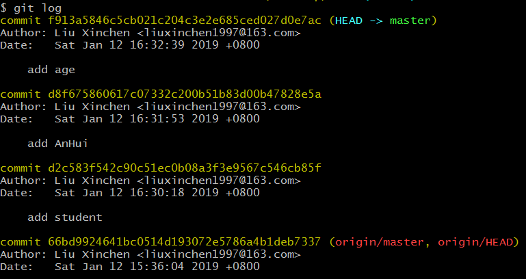

   当然，使用`git log --pretty=oneline`也是可以的：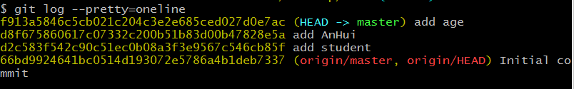

   可以看出我一共commit了4次：（1）Initial commit（这一次是在GitHub上创建repo的时候自动提交的）。（2）add student.（3）add AnHui.（4）add age.前面一大串黄色的字符串是**commit id**. 我们需要使用**commit id**来指定回退到哪个版本。

   其中（1）commit message为`add student`时，**info.txt**的内容是：

   ```
   I am a student.
   ```

   （2）commit message为`add AnHui`时，**info.txt**的内容是：

   ```
   I am a student.
   I am from AnHui.
   ```

   （3）commit message为`add age`时，**info.txt**的内容是：

   ```
   I am a student.
   I am from AnHui.
   I am 21 years old.
   ```

4. 我们当前的版本就是`HEAD`指向的版本，上一个版本就是`HEAD^`，上上个版本就是`HEAD^^`，上100个版本就是`HEAD~100`。OK，我们现在使用`git reset --hard HEAD^`来回退到上一个版本：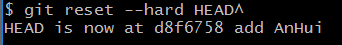

   查看`cat info.txt`，果然回退成功：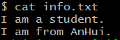

   如果这时我又想回到之前的`add age`的commit版本也是可以的，**前提是你得记得它的commit id**。因为这时我们使用`git log`查看的时候发现`add age`的commit已经没有了，取而代之的是HEAD指向`add AnHui`的commit！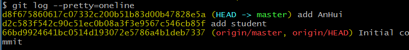

   我在命令行窗口中向上翻，查到`add age`的commit id，键入命令`git reset --hard f913a5`即可。**注意：commit id不需要全部输入，只需要输入前几个就可以。**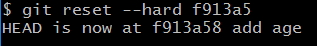

   果然回退成功了：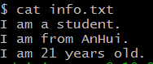

   注：如果无法在命令行窗口找到`add age`的commit id，使用`git reflog`可以查看每一次命令的记录：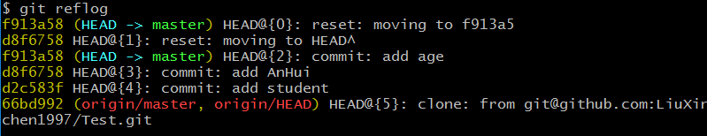

   前面黄色字符串就是每次命令操作之后的commit id的前几位。

### 1.2 撤销修改

> 前沿知识：Git在管理修改时在本地可以分为**工作区(`working tree`)**、**暂存区(`index`)**和**版本库(`tree-ish`)**三个区域，其中**工作区**就是我们日常编辑代码的区域，git记录工作区的所有修改。我们使用了`git add <file>`就将工作区的修改提交到了**暂存区**中。我们使用`git commit`就将暂存区中的内容全部提交到了**版本库**中，此时版本库中增加了一个最新的版本，HEAD指向该版本。`git push`将当前版本库中对应分支的最新版本提交到远端。

我们接着上面的内容来，我们对**info.txt**进行修改，添加一行`I love programming.`此时`git status`：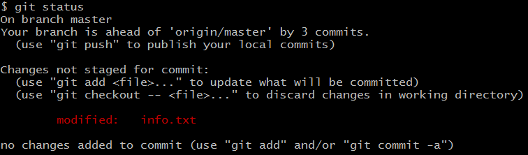

此时修改已经产生，我们分3种情况讨论如何将刚刚的修改回退掉。

1. 未`git add`

   这是最简单的情况，此时修改仅保存在工作区，还没有进入暂存区。使用`git checkout -- info.txt`将**info.txt**在工作区的修改全部撤销到最近的一次`git add`或者`git commit`（如果最近没有`git add`的话）：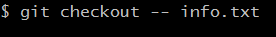

   果然撤销了修改。

2. 已经`git add`，但未`git commit`

   此时修改已经被提交到了暂存区，但是还没有进入版本库中。你可以：

   1. 使用`git reset HEAD info.txt`先把**info.txt**在暂存区的修改撤销掉，回到工作区：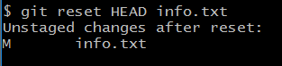
   2. 同上，使用`git checkout -- info.txt`对工作区中的修改撤销。

3. 已经`git commit`

   此时修改已经从暂存区被提交到了版本库中。这个时候可以使用`git reset --hard HEAD^`来强行回退到上一个版本，此时工作区的内容也回退到之前的版本。

> 关于命令`git reset`**
>
> 看了上面，我们可以看出，`git reset`不仅可以回退版本，也可以把暂存区中的修改回退到工作区中。那个命令`git reset HEAD info.txt`也是很神奇的（**Pro Git**书中原话`The command is a bit strange, but it works.`）。
>
> Git官方文档中`reset`命令的格式为：
>
> ```bash
> git reset [-q] [<tree-ish>] [--] <paths>…
> git reset (--patch | -p) [<tree-ish>] [--] [<paths>…]
> git reset [--soft | --mixed [-N] | --hard | --merge | --keep] [-q] [<commit>]
> ```
>
> 原来`index`就是指**暂存区**！而`tree-ish`可以理解成就是**版本库**了。
>
> 第1条命令：This form resets the index entries for all `<paths>` to their state at `<tree-ish>`. (It does not affect the working tree or the current branch.)
>
> `git reset HEAD info.txt`就是第1条命令，意思是将暂存区中的info.txt(<path>)回复到与版本库HEAD指向的commit相同的状态。也就是将暂存区中`git add`的**info.txt**给撤销掉了，因为**info.txt**的这个修改还并没有添加到版本库中，所以版本库中HEAD指向的commit **info.txt**还是之前的状态。
>
> 我们再来说说第3条命令：This form resets the current branch head to `<commit>` and possibly updates the index (resetting it to the tree of `<commit>`) and the working tree depending on `<mode>`. If `<mode>` is omitted, defaults to `--mixed`.
>
> 也就是会将当前分支的HEAD指向`commit`，并且会使暂存区重置到`<commit>`，工作区也可能会改变，不过这取决于参数`<mode>`.
>
> 关于参数`<mode>`（仅介绍`soft`和`hard`）:
>
> - `--soft`:Does not touch the index file or the working tree at all (but resets the head to `<commit>`, just like all modes do). This leaves all your changed files "Changes to be committed", as `git status` would put it.
>
>   仅仅重置HEAD指向`<commit>`，而并不会改变暂存区和工作区的内容。
>
> - `--hard`:Resets the index and working tree. Any changes to tracked files in the working tree since `<commit>`are discarded.
>
>   将HEAD指向`<commit>`，会重置暂存区和工作区，`<commit>`之后的改变全部都会丢弃。

### 1.3 参考资料

[[1] Git Documentation - reset](https://git-scm.com/docs/git-reset)

[[2] 廖雪峰git教程 - 版本回退/撤销修改](https://www.liaoxuefeng.com/wiki/0013739516305929606dd18361248578c67b8067c8c017b000/0013744142037508cf42e51debf49668810645e02887691000)

[[3] Pro Git Book - Undoing things](https://git-scm.com/book/en/v2/Git-Basics-Undoing-Things)

[[4] Pro Git Book - Reset Demystified](https://git-scm.com/book/en/v2/Git-Tools-Reset-Demystified#_git_reset)

[[5] CSDN git-reset用法总结](https://blog.csdn.net/chaiyu2002/article/details/81208639)
