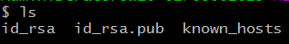
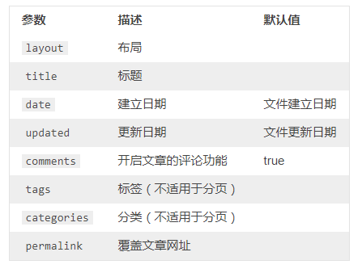

# Hexo博客系统尝鲜

> 昨晚和朋友吃饭时，听他说他用Hexo搭了一个博客系统，直接部署到Github上就可以访问了。想想自己之前花了九牛二虎之力搭建的阿里云+LAMP+Wordpress系统，心碎，于是今天花了一点时间尝试弄一下Hexo。
>
> 我主要是解决五个问题：
>
> 1. 搭建本地Hexo服务
> 2. 部署至Github
> 3. 如何更换主题
> 4. 如何发表博客
> 5. 如何在博客中插入图片

### 1 搭建本地Hexo服务

**Step 1 环境配置**

1. 确保电脑中已经安装了**node.js(npm)**、**git**，并且注册一个Github账号。

**Step 2 配置Github端**

1. 在Github上创建一个repo，repo名字必须是：**你的Github用户名.github.io**（注意，这很重要！！！）
2. 在**git bash**中输入`ssh -T git@github.com`，如果出现`Permission denied (publickey).`字样你则需要在github中配置public key
3. 在**Git Bash**中输入`ssh-keygen -C "你的github注册邮箱"`生成ssh密钥
4. 键入`cd ~`-->`cd .ssh`-->`ls`：
5. `cat id_rsa.pub`即可显示**ssh public key**
6. 进入自己的github主页，点击右上角的小头像-->下拉菜单中选择**Settings**-->**SSH and GPG keys**--> **New SSH key**（绿色按钮），将刚刚显示的**ssh public key**复制粘贴进去就可以。
7. 再一次输入`ssh -T git@github.com`，显示`Hi 你的github用户名! You've successfully authenticated, but GitHub does not provide shell access.`就表示成功了。

**Step 3 安装Hexo**

1. 到一个合适的文件夹下准备安装Hexo。输入`npm install hexo`.安装完成后会生成一个**node_modules**目录，存放Hexo依赖的各种包。
2. `./node_modules/hexo/bin/hexo`这个程序我们后面需要在命令中用到，如果嫌麻烦的话，可以将其加入环境变量。
3. 到一个**新的目录**（用于存放我们的博客项目）中，键入`hexo init`-->`npm install`-->`hexo generate`-->`hexo server`
4. 此时**Hexo服务已经运行了，我们在浏览器中键入`localhost://4000`即可访问！

### 2 部署至Github

1. 打开存放我们的博客项目的目录，打开文件**_config.yml**.

2. 在文件最下方输入：

   ```yaml
   deploy:
     type: git
     repo: git@github.com:你的Github用户名/你的Github用户名.github.io.git
     branch: master
   ```

3. 键入命令`npm install hexo-deployer-git --save`

4. 键入命令`hexo deploy`即可完成部署。

5. 在浏览器中键入`http://你的Github用户名.github.io`即可访问。

### 3 如何更换主题

1. 去[Hexo Themes](https://hexo.io/themes/)选择自己喜欢的主题，我们以主题**Aero-Dual**为例，现将其clone至本地`git clone https://github.com/levblanc/hexo-theme-aero-dual.git`。

2. 将文件夹的名字更改为`aero-dual`，并将该文件夹复制到`博客项目目录/themes/`

3. 在**_config.yml**中将`theme`修改为`theme: aero-dual`

4. 键入命令重新部署：`hexo clean`-->`hexo g`-->`hexo s`先在本地`localhost:4000`查看，觉得没有问题了再`hexo d`。

   > `hexo g` <==> `hexo generate`
   >
   > `hexo s` <==> `hexo server`
   >
   > `hexo d` <==> `hexo deploy`

5. 有的主题可能有特殊的设置，有疑问的话一定要多看对应主题的相关文档。

### 4 如何发表博客

1. 发表博客很容易，可以直接将写好的markdown文件**xxx.md**添加到`博客项目目录/source/_post/`中，也可以使用命令`hexo new [layout] <title>`，其中layout共有`post`/`page`/`draft`三种。我们直接忽略这个参数就好，默认是`post`.

2. 我们需要在写好的markdown文件开头加一些东西，形如：

   ```markdown
   ---
   title: A blog
   date: 2013/7/13 20:46:25
   categories:
   - programming
   tags:
   - Java
   - Python
   ---
   ```

   以上设定了文章的标题、日期、类别、标签等信息。还可以有：

3. 发布三步走：`hexo clean`-->`hexo g`-->`hexo s`（先本地）,再`hexo d`

> 实际上，`hexo g`的命令就会将`source`内的文件（比如md文件）自动生成html文件，并放到`public`文件夹下，我们可以在`public`目录下找到对应博客的index.html文件，用于发布到服务器中显示。

### 5 如何在博客中插入图片

1. 修改**_config.yml**的`post_asset_folder`为`post_asset_folder: true`.
2. 安装`npm install hexo-asset-image --save`
3. 现在最简单的方法就是将图片上传到某个远程服务器（比如新浪微博图库）中，这样我就只需要在md文件中直接输入图片的URL就可以了，实际上就不需要再在Hexo博客项目中上传图片了！比如，有人就是先在简书把博客写好，然后导出到本地，然后直接将导出的md文件添加到`source/_post`中即可。
4. 或 使用`hexo new "博客名xxx"`创建新博客，此时会在`source/_post`下生成目录`xxx`（专门用于给我们存放图片资源）和`xxx.md`。当然你不使用命令手动创建也是可以的，但是存放图片资源的目录一定要和`xxx.md`同名！！！
5. 现在我们按照markdown的格式，直接在md文件中引入图片就可以了：``
6. 发布三步走：`hexo clean`-->`hexo g`-->`hexo s`（先本地）,再`hexo d`.
