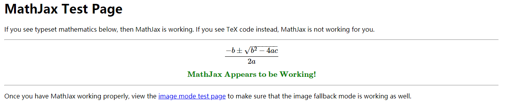
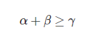

# WordPress填坑系列之（1） 手工搭建MathJax服务优雅编写LaTex

> 为了让自己能够在WordPress系统中优雅地使用LaTex编写数学公式，昨晚加上今天上午捣鼓了好久，一开始用插件**LaTex for WordPress**渲染LaTex，屡次尝试均失败！！！后弃之改用插件**MathJax-LaTex**，总的也算是终于成功了。
>
> 注意：我使用的是Ubuntu系统。

1. 安装Git：`apt install git`
2. clone **MathJax**项目：`git clone git://github.com/mathjax/MathJax.git MathJax`
3. 将项目中的git管理部分删除：`rm -rf MathJax/.git*`
4. 将**MathJax**项目复制到自己的apache服务器中的wordpress项目中：`cp -r MathJax/ xxx/wp-content/`
5. 别忘了给**MathJax**目录（刚刚复制到wordpress项目目录中的）添加可运行权限，这里为了方便，直接全部777：`chmod -R 777 xxx/wp-content/MathJax`
6. 启动apache服务器`/etc/init.d/apache2 start`，在浏览器中输入`<你的服务器域名>/wp-content/MathJax/test`进行测试，如果看到：,则表示**MathJax**服务安装成功！
7. 回到WordPress的管理后台，安装插件**MathJax-LaTex**。
8. 在设置-->MathJax-LaTex中，在**Custom MathJax Location?**中输入类似`<你的服务器域名>/wp-content/MathJax/MathJax.js`完成配置。
9. Ubuntu系统下重启apache服务：`/etc/init.d/apache2 restart`。
10. 此时编写博客，比如输入`[latex]\alpha+\beta\geq\gamma[/latex]`，渲染结果就是：