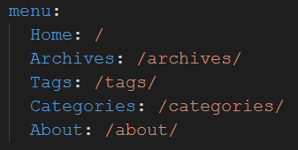
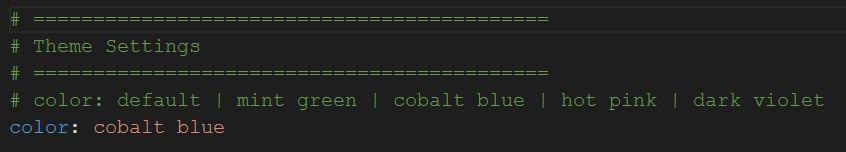
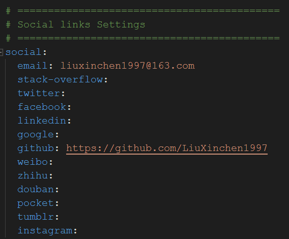

# Hexo尝鲜系列之（2）选择even主题

---
title: Hexo尝鲜系列之（2）选择even主题
categories: 
- 工具使用
tags: git
---

> 今天突然发现自己之前忙了半天的摘要问题，原来只需要在文章中添加`<!--more-->`就可以自动将该标识之前的所有内容作为展示的摘要了，自己真的是饶了一个大圈子！
>
> 另外，今天在博客系统Hexo中发现了一个很漂亮的主题**even**，下面我就来简单说说配置过程。

Hexo博客系统有个很大的好处——它的文档有中文的！这就方便多了，所以我的这篇文章显得很鸡肋了，仅做记录使用了。

1. 项目地址**https://github.com/ahonn/hexo-theme-even**，需要将项目clone下来`git clone https://github.com/ahonn/hexo-theme-even themes/even`。这里的命令已经直接clone到了**themes**目录下，并且已经将主题目录改名为了**even**。
2. 在自己的博客系统项目主目录中键入`npm install hexo-renderer-scss --save`，安装even主题渲染所需要的JS包。
3. 修改博客项目主目录下的**_config.yml**，将其内的`theme: `更改为`theme: even`.
4. 现在我们的博客已经成功转换成even主题风格了。

<!--more-->

接下来是对Even进行配置了。

1. 打开`themes/even/_config.yml`

2. `favicon: `用于设置博客系统网页的logo图标

3. `menu: `用于设置菜单选项，我们可以根据自己的需要，删去注释符号`#`，添加菜单选项，比如`Archives`,`Tags`,`Categories`,`About`等。

   注意，这里添加了`Tags`,`Categories`,`About`之后，这三个选项仍然是不能访问的。需要：

   1. `hexo new page categories`创建新页面，并在`categories/index.md`中添加：

      ```markdown
      title: categories
      layout: categories
      ```

   2. `hexo new page tags`创建新页面，并在`tags/index.md`中添加：

      ```markdown
      title: tags
      layout: tags
      ```

   3. `hexo new page about`创建新页面，并在`about/index.md`中添加：

      ```markdown
      title: about
      layout: page
      ```

4. 设置even的主题色调，共有`default`, `mint green`, `cobalt blue`, `hot pink`, `dark violet`几种可选：

5. 还可以设置社交媒体账号，这是我的设置结果：

6. 最后我还说说语言设置：语言设置需要到`themes/even/languages`目录下，系统默认调用的是**default.yml**文件内容。如果我要使用英文，则只需要直接将**en.yml**的内容复制覆盖**default.yml**文件内容即可。

7. 最后三步走部署，即可看到配置后的博客主题效果。


