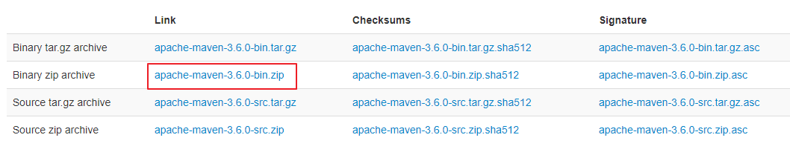
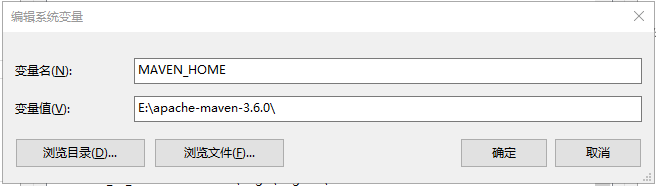
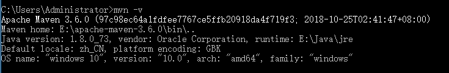
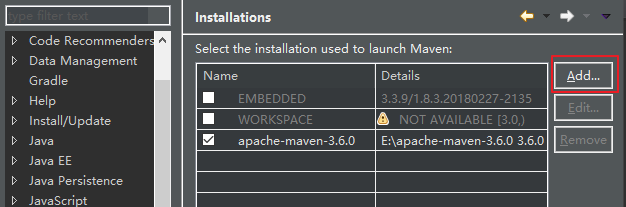
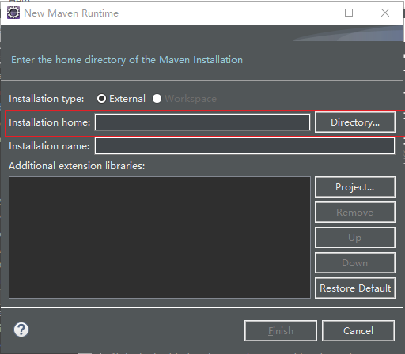
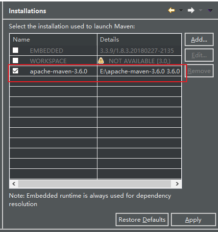
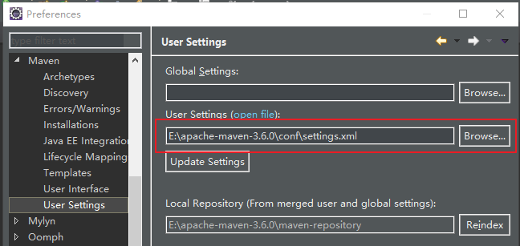
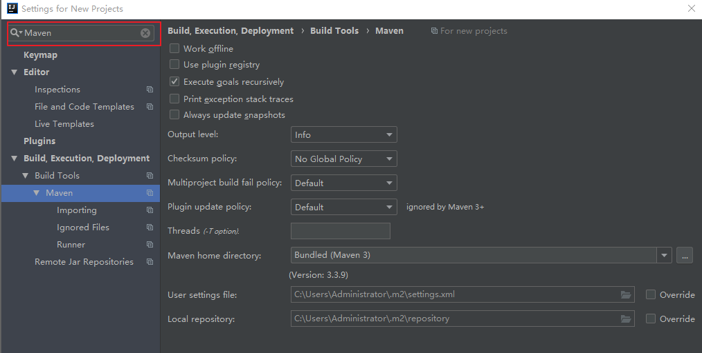
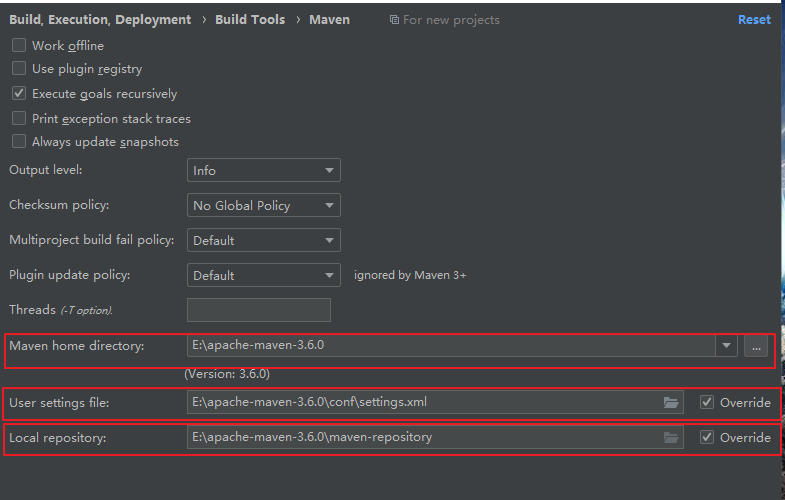
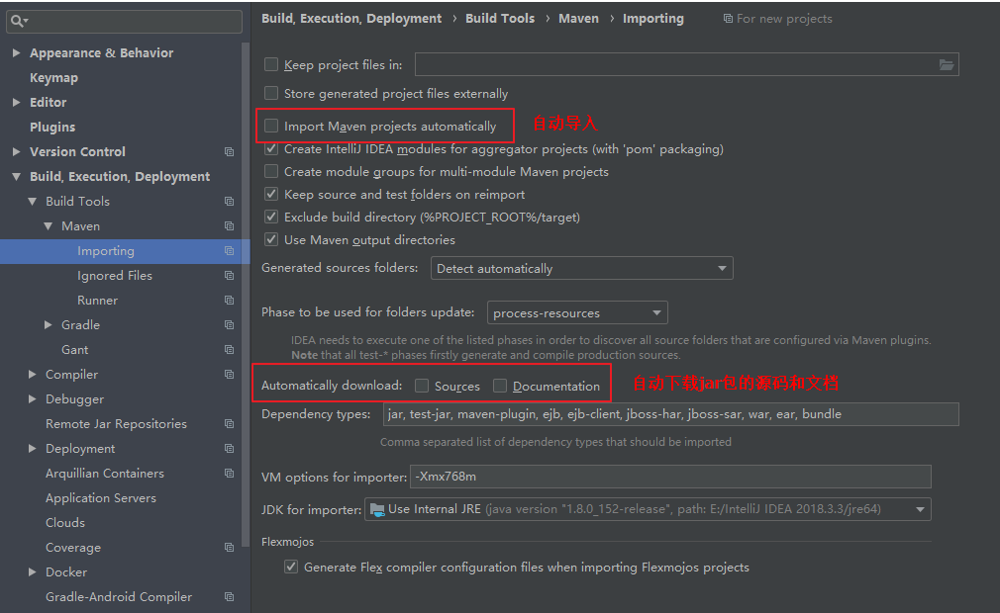

# 无痛配置Maven

---
title: 无痛配置Maven
categories: 
- 工具使用
tags: Maven
---

> 应实习需要，我得在自己的机器上配置一下Maven，其实总的来说配置Maven不难，但是由于国内网络环境较差，因此可能会走些弯路。
>
> 本篇文章共包括：
>
> 1. 安装Maven
> 2. 配置本地库和远程库
> 3. 在Eclipse中配置Maven
> 4. 在IntelliJ Idea中配置Maven

### 1 安装Maven

1. 先去[官网](http://maven.apache.org/download.cgi)下载Maven zip文件：
2. 下载完成之后在本地解压，我的解压地址是：`E:\apache-maven-3.6.0`
3. 配置环境变量：
   1. 新建系统环境变量**MAVEN_HOME**：
   2. 在系统环境变量**Path**中，添加`E:\apache-maven-3.6.0\bin`（根据你解压Maven的位置的不同而不同）
   3. 在cmd中输入`mvn -v`，出现以下则表示配置成功了：

<!--more-->

### 2 配置本地库与远程库

> Maven下载依赖的jar包的时候，会先在本地库查找，如果本地库没有的话再会去远程库查找下载，并会优先下载到本地库作为缓存。因为Maven默认的远程库在国外，访问速度很慢，因此我们需要将Maven的远程库配置成国内的镜像库，这样访问速度就快很多了。

1. 配置本地库

   1. 在`E:\apache-maven-3.6.0\`目录（你的Maven安装目录）下创建文件夹**maven-repository**.

   2. 在`E:\apache-maven-3.6.0\conf\settings.xml`文件中，添加

      ```xml
      <localRepository>E:\apache-maven-3.6.0\maven-repository</localRepository>
      ```

2. 配置远程库

   1. 在`E:\apache-maven-3.6.0\conf\settings.xml`文件中，添加

      ```xml
      <mirrors>
              <!-- 阿里云仓库 -->
              <mirror>
                  <id>alimaven</id>
                  <mirrorOf>central</mirrorOf>
                  <name>aliyun maven</name>
                  <url>http://maven.aliyun.com/nexus/content/repositories/central/</url>
              </mirror>
          
              <!-- 中央仓库1 -->
              <mirror>
                  <id>repo1</id>
                  <mirrorOf>central</mirrorOf>
                  <name>Human Readable Name for this Mirror.</name>
                  <url>http://repo1.maven.org/maven2/</url>
              </mirror>
          
              <!-- 中央仓库2 -->
              <mirror>
                  <id>repo2</id>
                  <mirrorOf>central</mirrorOf>
                  <name>Human Readable Name for this Mirror.</name>
                  <url>http://repo2.maven.org/maven2/</url>
              </mirror>
      </mirrors>
      ```

      添加远程库的时候要注意了，我之前添加的是OSChina镜像的远程库，但是好像OSChina的远程库早就不能用了，结果导致我的Maven在下载jar包的时候老是失败，踩坑！现在换成了阿里云镜像的远程库果然好用多了！

3. 运行一下`mvn help:system`，Maven会下载很多东西（这是应该就会去国内阿里云的镜像网站去下载了）。下载完成之后会提示：

   表示下载完成。

### 3 在Eclipse中配置Maven

1. 打开Eclipse，依次点击**Window**-->**Preferences**-->**Maven**-->**Installations**-->**Add..**:
2. 键入Maven下载地址：
3. 勾选并点击**apply**:
4. 依次点击**Window**-->**Preferences**-->**Maven**-->**User Settings**.选择刚刚我们配置的**settings.xml**文件:
5. 完成配置！

### 4 在IntelliJ Idea中配置Maven

1. 打开IntelliJ Idea的settings页面，搜索到Maven：
2. 添加Maven地址、刚刚配置的settings.xml文件地址（注意：在默认情况下使用的settings.xml文件是当前操作系统用户目录下.m2目录下的settings.xml文件，我们不用这个）和本地库地址：
3. 进入**Maven**---->**Importing**，红框内内容选择性勾选：
4. 完成配置！

### 5 参考资料

[[1] 如何配置IntelliJ Idea中的Maven？](https://blog.csdn.net/westos_linux/article/details/78968012)

[[2] 如何配置Maven？](https://www.cnblogs.com/eagle6688/p/7838224.html)