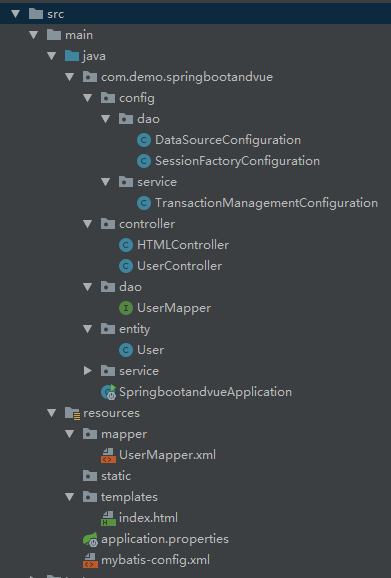

# SpringBoot+Vue实现前后端分离开发

[TOC]

> 对于前后端分离开发的理解：
> 以前做Web App开发时,总是由后台控制返回一个ModelAndView（即模板页+数据），模板定义好了需要什么数据，然后将数据在模板页中渲染出来生成一个页面html传给前端。
> 如今前后端分离，后台仅提供REST API，前端通过ajax请求获得json数据，并在当前页面渲染出来，路由跳转也由前端控制(vue-router).

## 0 技术栈

> 目前已经使用的技术：

| 类别 | 技术 |
| ------ | ------ |
| 前端 | Vue.js |
| ajax | axios |
| 前端 | Vue-Router |
| 后台 | Maven |
| 后台 | SpringBoot |
|持久化层 | MyBatis |
| 数据库 | MySql |
| 前端开发工具 | VS Code |
| 后台开发工具 | IntelliJ Idea |

## 1 搭建前端服务器

1. 下载安装node.js, cnpm等

1. 全局安装vue-cli脚手架：`cnpm install -g vue-cli`

1. cd到指定的目录创建项目，键入命令`vue init webpack`，然后会提示你输入项目名、描述等项目配置信息

1. 安装所有项目依赖，cd到项目的`package.json`文件的目录下，`cnpm install`安装所有依赖

1. 测试项目：`cnpm run dev` 打开`localhost:8080`查看是否成功

1. `cnpm install vue-router`安装vue-router，并配置了一个简单的vue-router使用demo

    `/src/App.vue`:

    ```html
    <template>
    <div id="app">
        
        <h1>Hello App!</h1>
        <p>
        <!-- 使用 router-link 组件来导航. -->
        <!-- 通过传入 `to` 属性指定链接. -->
        <!-- <router-link> 默认会被渲染成一个 `<a>` 标签 -->
        <router-link to="/">Go to 首页</router-link> &nbsp;&nbsp;
        <router-link to="/foo">Go to Foo</router-link> &nbsp;&nbsp;
        <router-link to="/bar">Go to Bar</router-link>
        </p>
        <!-- 路由匹配到的组件在下面渲染 -->
        <router-view/>
    </div>
    </template>
    ```

    `/src/router/index.js`

    ```javascript
    import Vue from 'vue'
    import Router from 'vue-router'
    import HelloWorld from '@/components/HelloWorld'
    import Foo from '@/components/Foo'
    import Bar from '@/components/Bar'

    Vue.use(Router)

    export default new Router({
    routes: [
        {
        path: '/',
        name: 'HelloWorld',
        component: HelloWorld
        },
        {
        path: '/foo',
        name: 'Foo',
        component: Foo
        },
        {
        path: '/bar',
        name: 'Bar',
        component: Bar
        }
    ]
    })
    ```

    `/src/components/Foo.vue`

    ```html
    <template>
    <div>
        <h1>This is a {{name}} page!</h1>
    </div>
    </template>
    ```

1. 安装`cnpm install vue-resource --save`和`cnpm install jquery --save`

1. 在`/build/webpack.base.conf.js`文件中添加：

    ```javascript
    const webpack  = require("webpack")
    ```

    以及

    ```javascript
    plugins: [
        new webpack.optimize.CommonsChunkPlugin('common.js'),
        new webpack.ProvidePlugin({
            jQuery: "jquery",
            $: "jquery"
        })

    ]
    ```

1. 解决跨域问题

    > 同源是指域名、协议和端口均相同，同源策略就是指基于安全考虑，当前域不能访问其他域的东西。
    > 但是，`img`的`src`(获取图片)、`link`的`href`(获取css)和`script`和`src`(获取 js)这三个都是可以不符合同源策略的。
    > JSONP是一种跨域方式，原理就是通过构造一个`script`标签来实现跨域。
    > jQuery封装了JSONP，可以通过jQuery的`ajax`来使用JSONP。

    ```javascript
    $.ajax({
        async : true,
        url : "https://api.douban.com/v2/book/search",
        type : "GET",
        dataType : "jsonp", // 返回的数据类型，设置为JSONP方式
        jsonp : 'callback', //指定一个查询参数名称来覆盖默认的 jsonp 回调参数名 callback
        jsonpCallback: 'handleResponse', //设置回调函数名
        data : {
            q : "javascript",
            count : 1
        },
        success: function(response, status, xhr){
            console.log('状态为：' + status + ',状态是：' + xhr.statusText);
            console.log(response);
        }
    });
    ```

    在本项目中，我们的前端代码（Vue）运行在8000端口，后台（SpringBoot）代码运行在8080端口，前端ajax请求后台REST API会存在跨域问题，我们需要解决。否则会因为同源策略而请求失败。

    在`/config/index.js`中添加`proxyTable`:

    ```javascript
    proxyTable: {
        '/api': {
            target: 'http://localhost:8080',
            changeOrigin: true,
            pathRewrite: {
                '^/api': ''
            }
        }
    },
    ```

    根据以上修改，每当前端请求类似`/api/*`，系统都会系统转为去请求`localhost:8080/*`，注意这里`api`仅作标识，并不会出现在真正的请求url中。

1. 修改运行端口，因为vue默认的运行端口是8080，而SpringBoot tomcat的默认运行端口也是8080，所以必须修改其中之一的端口号。
    我们在`/config/index.js`中将`port`改为`8000`.

## 2 搭建后端服务器

1. 使用IntelliJ Idea，傻瓜式操作，创建一个SpringBoot项目。

1. 创建一个用于存放controller类的package，并创建一个UserController类

    ```java
    @RestController
    public class UserController {

        @GetMapping("/user/get/{id}")
        public Map<String, Object> findUserById(@PathVariable int id) {
            Map<String, Object> map = new HashMap<>();
            map.put("id", id);
            map.put("name", "Tom");
            map.put("gender", "man");

            return map;
        }
    }
    ```

1. 运行，输入`localhost:8080/user/get/1`即可获得json

## 3 使用ajax

> 目前使用ajax主要有3种方式(jQuery/axios/fetch)，我们使用axios

1. 安装`cnpm install axios --save`

1. 在`main.js`中添加：

    ```javascript
    import axios from 'axios'
    Vue.prototype.$axios = axios
    ```

1. 在需要使用axios的组件中使用：

    ```javascript
    this.$axios.get('/api/user/get/1').then(res => {
        console.log(res.data)
    })
    ```

## 4 引入持久化层并使用MyBatis

> 到目前为止，我们的前后端服务器都已经架设完成，并且前后端也已经完全连通了。可以进行前后端分离开发了！
> 但是我们并未涉及持久化层，在这一步中我将引入mysql，并使用mybatis框架。
> mybatis框架有xml和注解两种方式，我是用xml方式，注解方式推荐使用`JPA`。
> 引入持久化层我们得进行一些配置，配置主要在`application.properties`或`application.yml`文件中继续进行.注意`application.properties`的优先级高于`application.yml`

1. 创建mysql数据库test，并创建表user：

    ```sql
    create database test;
    
    use test;
    
    create table user (
        id int primary key,
        name varchar(20),
        gender varchar(10)
    );
    ```

1. 使用IntelliJ Idea创建SpringBoot项目时，可以把`web`/`mysql`/`mybatis`这几个依赖全选上
    参考`pom.xml`，后面有些依赖需要自己手动加上：

    ```xml
    <?xml version="1.0" encoding="UTF-8"?>
    <project xmlns="http://maven.apache.org/POM/4.0.0" xmlns:xsi="http://www.w3.org/2001/XMLSchema-instance"
            xsi:schemaLocation="http://maven.apache.org/POM/4.0.0 http://maven.apache.org/xsd/maven-4.0.0.xsd">
        <modelVersion>4.0.0</modelVersion>
        <parent>
            <groupId>org.springframework.boot</groupId>
            <artifactId>spring-boot-starter-parent</artifactId>
            <version>2.1.3.RELEASE</version>
            <relativePath/> <!-- lookup parent from repository -->
        </parent>
        <groupId>com.demo</groupId>
        <artifactId>springbootandvue</artifactId>
        <version>0.0.1-SNAPSHOT</version>
        <name>springbootandvue</name>
        <description>Demo project for Spring Boot</description>

        <properties>
            <java.version>1.8</java.version>
        </properties>

        <dependencies>
            <dependency>
                <groupId>org.springframework.boot</groupId>
                <artifactId>spring-boot-starter-web</artifactId>
            </dependency>

            <dependency>
                <groupId>org.springframework.boot</groupId>
                <artifactId>spring-boot-starter-test</artifactId>
                <scope>test</scope>
            </dependency>
            <!--mybatis-->
            <dependency>
                <groupId>org.mybatis.spring.boot</groupId>
                <artifactId>mybatis-spring-boot-starter</artifactId>
                <version>2.0.0</version>
            </dependency>
            <!--mysql-->
            <dependency>
                <groupId>mysql</groupId>
                <artifactId>mysql-connector-java</artifactId>
                <version>5.1.46</version>
            </dependency>
            <!--线程池-->
            <dependency>
                <groupId>com.mchange</groupId>
                <artifactId>c3p0</artifactId>
                <version>0.9.5.2</version>
            </dependency>
            <!--访问resources/static下的静态资源-->
            <dependency>
                <groupId>org.springframework.boot</groupId>
                <artifactId>spring-boot-starter-thymeleaf</artifactId>
            </dependency>
        </dependencies>

        <build>
            <plugins>
                <plugin>
                    <groupId>org.springframework.boot</groupId>
                    <artifactId>spring-boot-maven-plugin</artifactId>
                </plugin>
            </plugins>
        </build>
    </project>
    ```

1. 修改`application.properties`,并添加一下内容：

    ```properties
    server.port=8080
    # server.servlet.context-path=/api

    #JDBC
    jdbc.driver=com.mysql.jdbc.Driver
    jdbc.url=jdbc:mysql://localhost:3306/test?useUnicode=true&characterEncoding=utf8&useSSL=false # 填写自己环境中的mysql url以及数据库
    jdbc.username=root # 填写用户名
    jdbc.password=root # 填写密码

    #MyBatis
    mybatis_config_file=mybatis-config.xml
    mapper_path=/mapper/*.xml # 填写映射xml文件包地址
    entity_package=com.demo.springbootandvue.entity # 填写实体类包地址

    # 定位模板的目录
    spring.mvc.view.prefix=classpath:/templates/
    # 给返回的页面添加后缀名
    spring.mvc.view.suffix=.html
    ```

1. 创建config包，并使用注解配置mybatis.代码举例：

    ```java
    //配置mybatis mapper的扫描路径
    @Configuration
    @MapperScan("com.demo.springbootandvue.dao")
    public class DataSourceConfiguration {
        @Value("${jdbc.driver}")
        private String jdbcDriver;
        @Value("${jdbc.url}")
        private String jdbcUrl;
        @Value("${jdbc.username}")
        private String user;
        @Value("${jdbc.password}")
        private String passWord;

        @Bean(name = "dataSource")
        public ComboPooledDataSource crateDataSource() throws PropertyVetoException {
            ComboPooledDataSource comboPooledDataSource=new ComboPooledDataSource();
            comboPooledDataSource.setDriverClass(jdbcDriver);
            comboPooledDataSource.setJdbcUrl(jdbcUrl);
            comboPooledDataSource.setUser(user);
            comboPooledDataSource.setPassword(passWord);
            //关闭连接后不自动提交
            comboPooledDataSource.setAutoCommitOnClose(false);
            return  comboPooledDataSource;
        }
    }
    ```

    ```java
    @Configuration
    @PropertySource("classpath:application.properties")
    public class SessionFactoryConfiguration {

        @Value("${mybatis_config_file}")
        private String mybatisConfigFilePath;
        @Value("${mapper_path}")
        private String mapperPath;
        @Value("${entity_package}")
        private String entityPackage;
        @Autowired
        @Qualifier("dataSource")
        private DataSource dataSource;

        @Bean("sqlSessionFactory")
        public SqlSessionFactoryBean createSessionFactoryBean() throws IOException {
            SqlSessionFactoryBean sqlSessionFactoryBean = new SqlSessionFactoryBean();
            sqlSessionFactoryBean.setConfigLocation(new ClassPathResource(mybatisConfigFilePath));
            PathMatchingResourcePatternResolver resolver = new PathMatchingResourcePatternResolver();
            String packageSearchPath = PathMatchingResourcePatternResolver.CLASSPATH_ALL_URL_PREFIX + mapperPath;
            sqlSessionFactoryBean.setMapperLocations(resolver.getResources(packageSearchPath));
            sqlSessionFactoryBean.setDataSource(dataSource);
            sqlSessionFactoryBean.setTypeAliasesPackage(entityPackage);
            return sqlSessionFactoryBean;
        }
    }
    ```

    ```java
    @EnableTransactionManagement
    @Configuration
    public class TransactionManagementConfiguration implements TransactionManagementConfigurer {

        @Autowired
        private DataSource dataSource;

        @Override
        public PlatformTransactionManager annotationDrivenTransactionManager() {
            return new DataSourceTransactionManager(dataSource);
        }
    }
    ```

1. 其余的业务代码（实体类、持久化映射层、Service层、Controller层）代码自行完成。
    注意：`UserMapper.java`存放在包`com.demo.springbootandvue.dao`内。而`UserMapper.xml`文件则放在目录`resources/mapper`内。
    实体类、`UserMapper.java`和`UserMapper.xml`可以直接由`mybatis-generator`工具生成。

1. 最后目录结构参考：

## 5 安装使用

1. clone项目到本地.GitHub地址：[https://github.com/LiuXinchen1997/SpringBootAndVue](https://github.com/LiuXinchen1997/SpringBootAndVue)

1. 进入`frontend`目录，键入`cnpm install`

1. 将项目导入`IntelliJ Idea`，IDE会自动下载Maven依赖。修改`application.properties`中关于数据库连接的内容，改为你自己的设置。

1. 准备数据库，创建数据库`test`(如果你按照上面的设置的话)，创建表`user`(sql语句见上面)，最后插入一些数据进入。

1. 在`IntelliJ Idea`启动后台，进入`frontend`目录并输入`npm run dev`启动前端，项目开始运行！

## 6 后期规划

1. 为项目添加`Element`等UI框架

1. 为项目添加使用`Mybatis-generator`